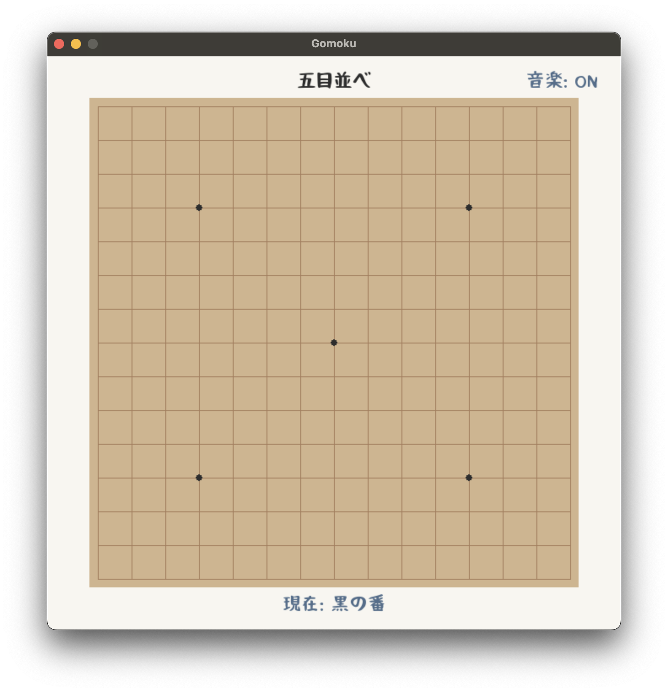

# Oh My Gomoku

一盘干净、直接、带一点木质桌面感的五子棋。

`Oh My Gomoku` 是一个基于 `pygame` 的本地双人对战项目：标准 `15×15` 棋盘、即时胜负判定、可选背景音乐，以及一套已经整理好的木质桌面风格界面。



## 这局棋有什么

- 标准 `15×15` 棋盘，黑先白后，轮流落子。
- 横向、纵向、斜向任意方向连成五子即可获胜。
- 棋盘落满且没人连成五子时，自动判为平局。
- 支持局内重开，不需要重启程序。
- 标题、状态提示、音乐按钮都使用项目内置界面资源。
- 如果 `assets/music` 里有可用音频，程序会随机循环播放，并允许暂停 / 恢复。

## 跑起来很直接

- Python `3.10+`
- 能正常显示桌面窗口的运行环境
- 如果你想用背景音乐，运行环境里最好有可用音频设备

下面的示例默认按 `python3` 来写；如果你的系统里没有这个命令，也可以改用 `python`，Windows 下通常可以用 `py -3`。

最短路径只需要两条命令：

```bash
python3 -m pip install -r requirements.txt
python3 gomoku.py
```

如果你习惯先创建虚拟环境，在 macOS / Linux 上可以这样跑：

```bash
python3 -m venv .venv
source .venv/bin/activate
python -m pip install -r requirements.txt
python gomoku.py
```

如果你在 Windows PowerShell 下，写法是这样：

```powershell
py -3 -m venv .venv
.venv\Scripts\Activate.ps1
python -m pip install -r requirements.txt
python gomoku.py
```

## 操作很简单

| 操作      | 说明                     |
|---------|------------------------|
| 鼠标左键    | 在棋盘交叉点落子               |
| `R`     | 重置当前对局                 |
| 右上角音乐按钮 | 暂停 / 恢复背景音乐（仅在音乐可用时启用） |
| 关闭窗口    | 退出游戏                   |

## 想让它有声音

程序会递归扫描 `assets/music` 目录及其子目录里的音频文件，再按这些扩展名筛选：

- `.mp3`
- `.wav`
- `.ogg`
- `.flac`
- `.m4a`
- `.mid`

仓库默认只保留 `assets/music/.gitkeep`，因此首次启动时通常不会播放音乐。把你自己的音频文件放进 `assets/music/` 后，重新启动程序即可；只有在成功加载并开始播放后，右上角音乐按钮才会启用。

需要注意的是：扩展名对上了，不代表当前环境里就一定播得出来。实际能不能用，还是要看本机 `pygame` / `SDL_mixer` 对对应格式的支持情况；不同平台下兼容性可能不一样。

## 目录里有什么

```text
.
├── assets
│   ├── AppIcon.png
│   ├── fonts/
│   └── music/
├── docs
│   └── screenshot.png
├── gomoku.py
├── requirements.txt
├── LICENSE
└── README.md
```

## 代码怎么分工

- `GameLogic` 负责规则：棋盘状态、落子校验、胜负和平局判定。
- `GameRenderer` 负责界面：棋盘、棋子、标题、状态提示和音乐按钮。
- `MusicController` 负责声音：音频初始化、文件扫描、随机播放和暂停 / 恢复。
- `GomokuGame` 负责把事件循环、渲染和规则调度到一起。
- 程序入口在 `main()`，最终由 `GomokuGame.run()` 启动主循环。

## 常见问题

**1. 启动时报 `No module named 'pygame'`**

说明你当前用来启动程序的 Python 解释器还没有装上依赖。用同一个解释器重新安装依赖即可，例如：

```bash
python3 -m pip install -r requirements.txt
```

**2. 音乐按钮是灰的，不能点**

常见原因通常有两类：

- `assets/music` 下没有可播放的音频文件。
- 当前环境里的音频设备或格式支持有问题，导致 `pygame.mixer` 初始化或加载失败。

**3. 程序无法打开窗口**

这通常说明当前环境没有可用的图形界面。这个项目是桌面 GUI 程序，纯终端或无显示服务的远程环境里一般无法正常运行 `pygame` 窗口。

## 许可证

本项目使用 [MIT License](LICENSE)。

另外，项目内置字体 `OtsutomeFont_Ver3_20.ttf` 遵循 `SIL Open Font License 1.1`，许可证原文见 `assets/fonts/OFL.txt`。
